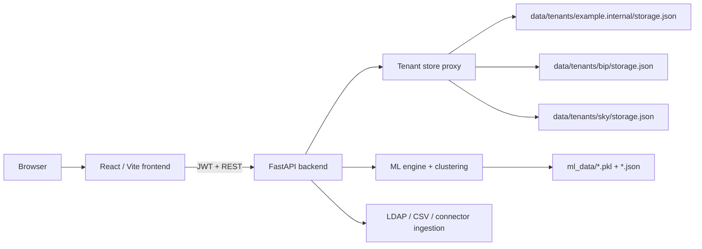

# Code architecture document

## Scope
This document describes the architecture implemented in the `Role_Mining`
repository as of May 19, 2026. It focuses on the parts that matter most for
understanding the product logic today: tenant isolation, authentication, local
state persistence, role mining, and the machine learning components that are
actually operational in the codebase.

The goal is to document the real runtime behavior, not an aspirational target
architecture.

## System overview
The application is a full-stack web product with a React/Vite frontend and a
FastAPI backend. The backend is a single deployable runtime that owns API
endpoints, tenant resolution, state persistence, data ingestion, clustering,
business role management, and ML-related services.

At runtime, the browser talks only to the backend over REST. The backend then
reads and writes two local persistence layers:

- tenant-scoped business state in
  `backend/data/tenants/<tenant-id>/storage.json`
- global ML artifacts in `backend/ml_data/*`

## Frontend architecture
The frontend is a single-page application rooted in
`frontend/src/app.jsx`. It owns routing, session bootstrapping, permission
gating, and page composition. The API client lives in
`frontend/src/api.js` and stores the JWT in `localStorage` under `rm_token`.

The login flow requires three values:

1. tenant domain
2. username
3. password

After login, the frontend calls `/api/me` to resolve the current user profile,
permissions, and tenant identity. The sidebar and route guards then derive
visibility from the permission flags returned by the backend.

Important UI characteristics:

- System user administration is implemented directly in
  `frontend/src/app.jsx`.
- Role modeling and most AI lab surfaces exist in the code, but the frontend
  feature flags in `frontend/src/featureFlags.js` keep major AI navigation
  paths disabled by default.
- The frontend already understands tenant-aware login because it sends the
  user-entered domain to `/api/auth/login`.

## Backend architecture
The backend public entrypoint is `backend/main.py`, but the actual
implementation lives in `backend/app/server.py`. The server is still a large
monolithic FastAPI module, even though some AI lab and pattern rule routes have
been extracted into `backend/app/api/ai_lab_routes.py` and
`backend/app/api/pattern_rules_routes.py`.

The backend runtime owns these responsibilities:

- request-scoped tenant binding
- JWT authentication and authorization
- tenant-local system users
- connector configuration and ingestion
- user and business-role management
- role mining and KPI computation
- ML model loading, learning, and suggestion serving
- AI lab analytics and synthetic workflows

This makes `backend/app/server.py` the operational center of the system.

## Tenant and instance model
The current codebase is no longer single-tenant. Tenant isolation is
implemented in `backend/app/db/storage.py` through a `TenantStoreProxy` layered
over a `JsonFileStore`.

The active tenant is selected through a context variable and resolved at two
levels:

- unauthenticated requests default to `example.internal`
- authenticated requests inherit `tenant_id` from the JWT

Each tenant gets its own persisted JSON state file:

- `backend/data/tenants/example.internal/storage.json`
- `backend/data/tenants/bip/storage.json`
- `backend/data/tenants/sky/storage.json`

The storage module also contains a one-time migration path from the legacy
single-tenant file `backend/data/storage.json` into the default tenant store.
That means the repository still contains legacy artifacts, but the live
application model is tenant-scoped.

### Tenant resolution at login
Tenant selection is domain-driven. The login request includes a `domain`
string, and the backend resolves it with `_resolve_tenant_for_login()` in
`backend/app/server.py`.

The mapping source is:

- built-in domain mappings such as `example.internal -> example.internal`
  and `bip.internal -> bip`
- optional environment override through `TENANT_DOMAIN_MAP`

If the domain is missing, the backend rejects the request. If the domain is not
mapped, the backend returns "Domain not authorized." This means a tenant is not
just a UI concept; it is an authorization boundary and a persistence boundary.

### Request lifetime and tenant context
The middleware `tenant_context_middleware()` binds the tenant context for the
entire request lifetime. That context drives every `state.get()` and
`state.set()` call because `state` is a tenant-aware proxy, not a single global
dictionary.

This is the key architectural rule for the whole backend:

Tenant-sensitive business data is isolated per instance, but the Python process
and most service logic are shared.

## Authentication and local system users
Authentication is JWT-based and implemented in `backend/app/server.py`.

The flow is:

1. The client posts `username`, `password`, and `domain` to
   `/api/auth/login`.
2. The backend resolves the tenant from the domain.
3. Inside that tenant context, it looks up the local system user list stored in
   `state["system_users"]`.
4. It verifies the password against a PBKDF2-SHA256 hash.
5. It issues a JWT containing `sub`, `tenant_id`, `tenant_domain`, and `exp`.

Each tenant owns its own local admin and viewer accounts. The bootstrap logic
in `_ensure_system_users_state()` seeds default records if the tenant has no
system users yet. Those records are persisted inside the tenant storage file,
not in a central identity database.

Permission enforcement is capability-based. The important flags are:

- `can_view_analytics`
- `can_view_cluster`
- `can_view_users`
- `can_view_business_roles`
- `can_view_ai_training`
- `can_view_configurations`
- `can_view_logs`
- `can_view_system_users`
- `can_manage_settings`
- `can_manage_assignments`

This means "instance administration" is local to each tenant. An admin in one
tenant does not automatically exist in another tenant unless you create or seed
that user there too.

## Persistent state model
Tenant business state is file-based JSON. The default shape is initialized in
`_init_default_state_on_store()` in `backend/app/db/storage.py`.

The most important keys are:

- `connector`: connector and ingestion configuration
- `last_extract`: current tenant user and group snapshot
- `last_mining`: latest role mining result, matrix, and KPI payload
- `role_meta`: business role metadata and template groups
- `business_roles`: known business role set
- `user_business_role`: explicit user-to-business-role mapping
- `logs`: in-app log feed
- `dq_*`: data quality configuration and feedback
- `system_users`: local tenant application users

The store is thread-safe and uses atomic file replacement through temporary
files plus `os.replace()`. The design is simple and resilient for local
single-process development, but it is not a substitute for a transactional
database.

## Ingestion and operational data flow
The backend can populate tenant data from multiple sources:

- LDAP / Active Directory
- CSV import
- SAP and other configured connectors
- mock generators

No matter which source feeds the system, the operational target is always the
same tenant state structure under `last_extract`.

The general ingestion sequence is:

1. Normalize source-specific fields into a user record.
2. Infer or preserve account type and business role metadata.
3. Deduplicate or merge colliding identities.
4. Persist the new tenant snapshot.
5. Mark mining as dirty.
6. Trigger post-snapshot rebuild logic for derived state.

This is important because the ML and clustering layers do not read directly
from external systems. They read from the normalized tenant snapshot already
stored in application state.

## Role mining pipeline
Role mining is not implemented in `ml_engine.py`. It is implemented directly in
`backend/app/server.py`.

The pipeline uses classic unsupervised learning primitives:

- binary user-group matrix construction
- dimensionality reduction with `TruncatedSVD`
- clustering with `MiniBatchKMeans`

The output is persisted in `state["last_mining"]` and includes:

- the user-group matrix
- discovered clusters
- KPI values
- timestamps and mining parameters

This is production logic, not a placeholder. The cluster-based analytics pages
and several KPI views depend on this persisted output.

## Machine learning: what is real
The repository contains both real ML behavior and simulated AI-lab behavior.
They are not the same thing and should not be treated as equivalent.

### Real ML in production paths
The real ML logic lives in `backend/ml_engine.py`.

It currently provides two operational capabilities:

1. Account type classification
2. BRDB learning for business-role-to-group suggestions

#### Account type classifier
The account classifier is a genuine scikit-learn pipeline. It builds text
features from user identity attributes and trains either:

- `LogisticRegression` for multiclass cases, or
- `MultinomialNB` for small binary cases

Feature extraction uses `TfidfVectorizer`. Trained artifacts are persisted to
`backend/ml_data/account_classifier.pkl`.

Inference is hybrid:

- if a trained model exists, use ML prediction with confidence
- otherwise, fall back to rule-based classification using naming and OU
  heuristics

This is real ML with a deterministic heuristic safety net.

#### BRDB group suggestion learner
The BRDB subsystem is also operational. It learns statistical associations
between business roles and groups by accumulating confirmed assignments.

Persisted BRDB artifacts include:

- `role_group_counts`
- `group_role_primary`
- `role_suggestions`
- `total_assignments`

These are stored in `backend/ml_data/brdb_state.json`.

Suggestion generation is hybrid:

- statistical confidence from observed role-group assignments
- optional enrichment from `knowledge_base.json` if present

This means the system can serve practical group suggestions without requiring a
large external model runtime.

### Real but mostly heuristic analytics
Some analytics exposed as "AI" are deterministic or heuristic rather than
learned models.

Examples:

- smart anomaly detection based on peer and department rarity thresholds
- model quality scoring composed from weighted penalties
- overprivileged and policy-violation detection

These are real operational analytics, but they are not ML training pipelines.
They are rules and statistical scoring implemented in the backend.

## Machine learning: what is not production ML
The AI lab module in `backend/app/api/ai_lab_routes.py` mixes useful analysis
with simulated model comparisons.

Examples of non-production ML behavior:

- A/B model comparison uses `_simulate_quality_for_model()`
- timeline runs create synthetic training snapshots and metadata
- synthetic case generation intentionally fabricates test records

This code is still useful for experimentation and demos, but it is not the same
as the operational ML path used by login, ingestion, role mining, or business
role suggestion flows.

The role modeling sandbox in `backend/app/server.py` also includes scenario
simulation and synthetic training data generation for ranking and proposal
explanation. It is architecture support logic, not a deployed predictive model
that learns from live tenant data in the same way as the account classifier or
BRDB learner.

## Frontend to backend feature alignment
There is an important product behavior gap between implemented backend
capabilities and visible frontend navigation.

The backend exposes many AI-oriented routes, but
`frontend/src/featureFlags.js` currently sets:

- `AI_FEATURES_ENABLED = false`
- `ROLE_MODELING_ENABLED = false`

As a result:

- AI training and AI lab pages exist in code but are mostly hidden from the
  main navigation
- system-user permission grouping filters out some AI permissions when the
  frontend flag is disabled
- core tenant, role, user, cluster, and reporting flows remain visible

Architecturally, the backend is ahead of the frontend in feature exposure.

## End-to-end logic of the platform
The implemented product logic can be summarized as a layered pipeline:

1. Resolve the tenant from the login domain.
2. Authenticate against tenant-local system users.
3. Bind the tenant context for every request.
4. Ingest or update tenant identity data into `last_extract`.
5. Derive clusters, KPIs, and role intelligence from that normalized snapshot.
6. Persist all tenant outputs back into the same tenant store.
7. Use global ML artifacts to improve classification and suggestions across
   runtime sessions.

The most important design choice is that tenant state is isolated, while the ML
engine artifacts are process-global and file-global. In practice, that means:

- business data is per tenant
- the learned classifier and BRDB artifacts are shared by the application
  runtime unless you explicitly separate `ml_data`
- global ML learning events can aggregate signals across tenants

This is a deliberate trade-off: the application is multi-tenant in state
storage, but not fully multi-tenant in ML artifact isolation.

## Key files
This section lists the main files you need to understand when you work on the
architecture.

- `backend/main.py`: compatibility entrypoint
- `backend/app/server.py`: primary backend runtime and business logic
- `backend/app/db/storage.py`: tenant-aware JSON persistence
- `backend/ml_engine.py`: account classification and BRDB learning
- `backend/app/api/ai_lab_routes.py`: AI lab analytics and simulated workflows
- `backend/app/api/pattern_rules_routes.py`: pattern-rule configuration APIs
- `frontend/src/app.jsx`: router, login, permissions, and admin UI
- `frontend/src/api.js`: REST client and token handling
- `frontend/src/featureFlags.js`: frontend exposure gates

## Architectural strengths
The current design has a few strong qualities despite being monolithic.

- It is easy to run locally with no external database.
- Tenant separation is explicit and already operational.
- The system preserves useful state across restarts.
- The real ML pieces are lightweight, explainable, and cheap to run.
- The clustering pipeline is directly tied to the tenant snapshot, which keeps
  the analytical flow understandable.

## Architectural constraints and risks
The current design also has structural limits that matter for future work.

- `backend/app/server.py` concentrates too many responsibilities.
- File-based tenant storage is simple but weak for concurrency, auditability,
  and horizontal scale.
- ML artifacts are global, so they are not strictly isolated per tenant.
- Several AI-facing features are simulations or synthetic tooling, which can be
  mistaken for production ML unless documented clearly.
- Frontend feature flags hide backend capabilities, which can create product
  confusion during testing.

## Recommended next steps
The next architectural steps are now clearer from the codebase.

1. Split `backend/app/server.py` into domain routers and services.
2. Decide whether `ml_data` must remain shared or become tenant-scoped.
3. Promote only the AI features that have production semantics to the main
   frontend navigation.
4. Move tenant business state from JSON files to a transactional store if
   concurrent usage becomes important.
5. Keep this document updated whenever tenant resolution or ML ownership rules
   change.
