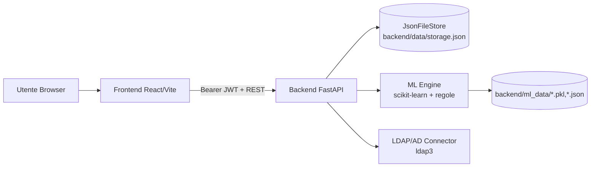

# Documento Architetturale del Codice

## 1. Scopo e perimetro
Questo documento descrive l'architettura **implementata nel codice** del progetto `Role_Mining`, con focus su:
- componenti runtime (frontend, backend, storage locale, engine ML);
- flussi applicativi principali;
- modello dati persistito;
- endpoint API e responsabilita';
- criticita' tecniche osservate.

Il documento riflette lo stato del repository al **11 Febbraio 2026**.

## 2. Panorama architetturale
Il sistema e' una web app full-stack con backend `FastAPI` e frontend `React/Vite`.
La persistenza e' file-based (JSON locale), con stato applicativo centralizzato in `backend/data/storage.json`.

## 3. Componenti principali

### 3.1 Frontend (`frontend/src`)
- SPA React con routing via `react-router-dom`.
- Entry point: `frontend/src/main.jsx`.
- Shell applicativa e pagine principali in `frontend/src/app.jsx` + pagine lazy in `frontend/src/pages/*`.
- Client API centralizzato in `frontend/src/api.js` con gestione token JWT in `localStorage` (`rm_token`).
- Librerie UI/visualizzazione:
  - `ag-grid-react` per tabelle;
  - `react-plotly.js` per KPI/chart.

### 3.2 Backend API (`backend/main.py`)
- Monolite FastAPI con responsabilita' multiple:
  - autenticazione JWT;
  - estrazione AD/LDAP e ingest CSV/XLSX;
  - role mining (clustering);
  - KPI e drilldown;
  - gestione business role;
  - servizi ML/BRDB e pattern rules.
- Middleware:
  - CORS aperto (include `*`);
  - GZip per payload > 1000 byte.
- Cache in-memory TTL (`ResponseCache`) per endpoint ad alta frequenza.

### 3.3 Storage applicativo (`backend/app/db/storage.py`)
- `JsonFileStore` thread-safe con `RLock`.
- Persistenza completa dello stato applicativo in JSON.
- Inizializzazione stato di default con chiavi operative (`last_extract`, `last_mining`, `role_meta`, `user_business_role`, ecc.).

### 3.4 ML Engine (`backend/ml_engine.py`)
- Classificazione tipo account (ML + fallback rule-based).
- BRDB (Business Role Database) per inferenza ruolo da gruppi.
- Persistenza modelli e storico in `backend/ml_data/`:
  - `account_classifier.pkl`
  - `training_history.json`
  - `pattern_rules.json`
  - `brdb_state.json`

## 4. Flussi applicativi principali

### 4.1 Autenticazione
1. `POST /api/auth/login` valida credenziali (`APP_LOGIN_USER/PASS`).
2. Backend emette JWT HS256.
3. Frontend salva token in `localStorage`.
4. Endpoint protetti usano `Depends(require_auth)`.

### 4.2 Ingest da AD/LDAP
1. Configurazione connettore (`/api/config/connector`).
2. `POST /api/ad/extract`:
   - connessione LDAP;
   - mapping utenti+gruppi;
   - deduplica e merge con stato esistente;
   - auto-assegnazione business role;
   - rebuild candidati ingest e risoluzione duplicati.
3. Stato aggiornato in `last_extract`; mining marcato `dirty`.

### 4.3 Ingest CSV/XLSX
- `POST /api/import/csv`: parser header flessibile, merge per `displayName/username`, riallineamento BR.
- `POST /api/import/xlsx`: import semplificato da colonne obbligatorie.
- In entrambi i casi: aggiornamento stato + invalidazione logica del mining.

### 4.4 Role Mining
1. Trigger: `POST /api/rolemining/run`.
2. Esecuzione worker (background):
   - costruzione matrice utente-gruppo;
   - riduzione dimensionale `TruncatedSVD`;
   - clustering `MiniBatchKMeans`;
   - costruzione cluster (`members`, `roleGroups`, `purity`);
   - calcolo KPI.
3. Persistenza risultato in `last_mining`.

### 4.5 KPI e Drilldown
- `GET /api/kpi`: ritorna metriche aggregate (cluster quality, model quality, AI detection, role coverage).
- `GET /api/kpi/drilldown/{metric}`: dettaglio per metrica (`cluster-quality`, `model-quality`, `ai-detection`, `overprivileged`).
- `POST /api/ai-detection/run`: analisi anomalie smart (peer/dept/policy).

## 5. Modello dati (stato persistito)
Chiavi principali in `storage.json`:
- `connector`: configurazione LDAP/mock;
- `last_extract`: snapshot utenti/gruppi sorgente;
- `last_mining`: output clustering + KPI + matrice;
- `role_meta`: metadati business role (colore, gruppi template);
- `business_roles`: insieme ruoli noti;
- `user_business_role`: mapping utente -> business role;
- `last_ingest_stats`, `last_rejects`: qualita' ingest;
- `ingest_sources`, `ingest_candidates`, `choice_by_displayName`: gestione conflitti ingest;
- `brdb_*`, `last_ai_detection`: stato inferenza BR e AI detection.

## 6. API surface (macro-domini)
- Auth: `/api/auth/*`, `/api/me`.
- Connector & ingest: `/api/config/connector`, `/api/ad/extract`, `/api/import/*`, `/api/ingest/conflicts/*`.
- Users: `/api/users*`, `/api/users/{uname}/update`, `/api/users/{uname}/peer-analysis`.
- Role mining & KPI: `/api/rolemining/*`, `/api/kpi*`, `/api/drilldown/overprivileged`.
- Business roles: `/api/businessroles*`.
- ML/BRDB: `/api/ml/*`, `/api/brdb/status`, `/api/config/ad-fields`.

## 7. Deployment e runtime
`docker-compose.yml` definisce due servizi:
- `backend`: FastAPI su porta host `9000 -> 8000`.
- `frontend`: Vite dev server su `5173`.

Note runtime:
- backend monta volume `./backend:/app` e avvia uvicorn con `--reload`;
- frontend monta sorgenti live e dipende dal backend;
- persistenza dati e modelli avviene su filesystem locale (no DB esterno).

## 8. Vincoli e trade-off architetturali
- Approccio monolitico accelera sviluppo ma concentra complessita' in `backend/main.py`.
- Storage JSON semplifica setup ma limita concorrenza/scalabilita' e auditing strutturato.
- Background task in-process: semplice, ma senza job queue esterna (affidabilita' limitata su restart/crash).
- Cache in-memory: migliora latenza, ma non condivisa tra processi/istanze.

## 9. Criticita' tecniche rilevate dal codice
1. **Disallineamento firma funzione**:
   - chiamata `classify_account(..., attributes=d)` durante extract LDAP;
   - firma definita senza parametro `attributes`.
   - Impatto: rischio eccezione per record LDAP e perdita dati in ingest.

2. **Endpoint frontend non implementati nel backend**:
   - `frontend/src/api.js` invoca `/api/ai/suggest-business-role-online`, `/api/ai/suggest-business-role-hybrid`, `/api/ai/health`;
   - endpoint non presenti in `backend/main.py`.

3. **Stato BRDB incompleto per `/api/brdb/status`**:
   - endpoint legge `state["brdb_calculated"]`, `state["brdb_min_confidence"]`, `state["brdb_last_update"]`;
   - chiavi non inizializzate nello stato default visibile.

4. **Duplicazione/sovrascrittura logica BRDB nello stesso file**:
   - presenti piu' definizioni di funzioni BRDB (prima custom, poi delegate a `ml_engine`).
   - Impatto: manutenzione complessa e possibile comportamento inatteso.

5. **Configurazione CORS permissiva**:
   - `allow_origins` include `*` insieme a credenziali, appropriato solo per ambienti non-prod.

## 10. Raccomandazioni architetturali (priorita')
1. Separare `backend/main.py` in moduli (`routers`, `services`, `domain`, `repositories`).
2. Uniformare contratti frontend-backend (OpenAPI-first o client generato).
3. Introdurre DB transazionale (es. PostgreSQL) per stato operativo e storico decisioni.
4. Portare job asincroni critici su coda esterna (es. Celery/RQ) per resilienza.
5. Aggiungere test di contratto API e smoke test su endpoint chiave ingest/mining.

## 11. File di riferimento
- Backend API: `backend/main.py`
- Storage: `backend/app/db/storage.py`
- ML Engine: `backend/ml_engine.py`
- Frontend shell: `frontend/src/app.jsx`
- Frontend API client: `frontend/src/api.js`
- Deploy locale: `docker-compose.yml`
