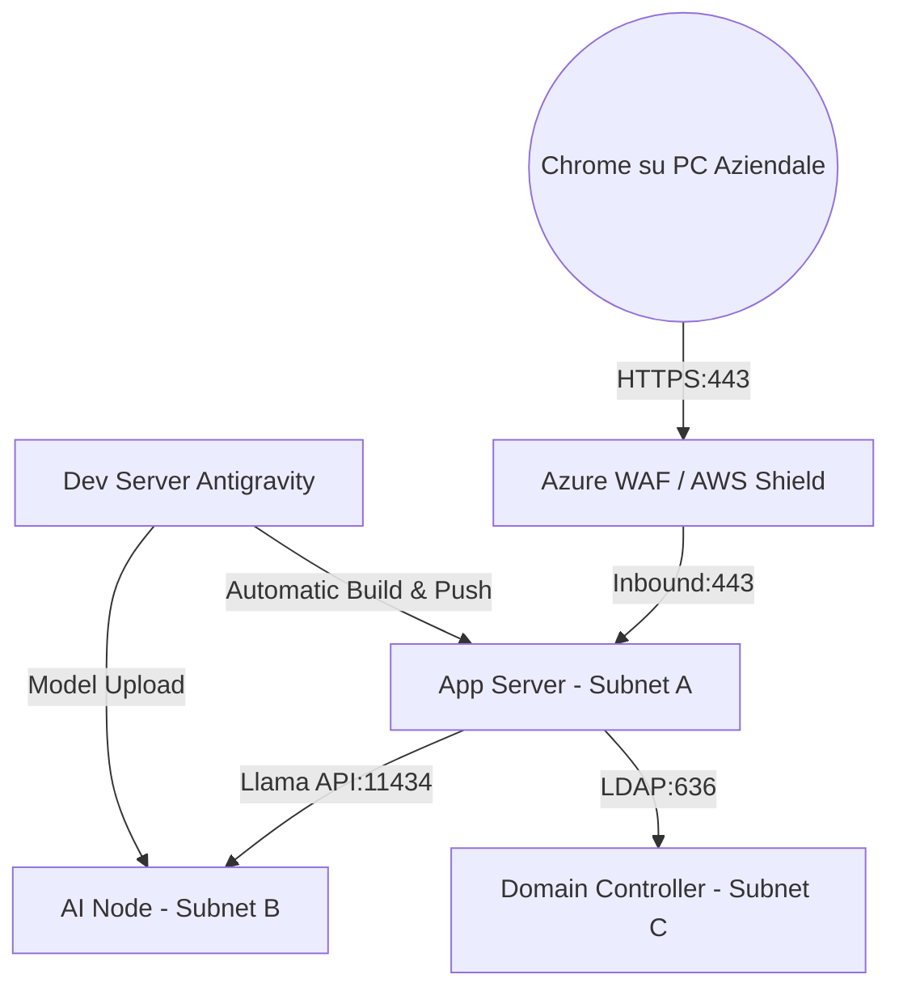

# Architettura Tecnica e Piano di Hosting: Role Builder AI

Questo documento definisce gli obiettivi del software, l'architettura omnicomprensiva, i requisiti infrastrutturali Cloud/Windows e il ciclo di vita funzionale del sistema **Role Builder AI**.

---

## 1. Cosa fa il programma (Product Overview)

**Role Builder AI** è un tool specializzato nell'offrire un servizio avanzato di **Role Mining**, progettato specificamente per l'**analisi approfondita dell'ambiente di un cliente**. L'obiettivo primario del software è quello di mappare lo stato attuale dei permessi per **predisporre l'ambiente ad un AD Cleanup** (bonifica di Active Directory) e alla successiva fase di **Role Modeling**.

---

## 2. Architettura ad Alto Livello e Networking

Il sistema opera in un ambiente Cloud isolato suddiviso in sottoreti per massimizzare la sicurezza (Zero Trust).

---

## 3. Requisiti Infrastrutturali (Tabelle per VM)

Per un deployment enterprise ottimizzato, l'infrastruttura si compone di 4 macchine virtuali dedicate.

### 3.1 Server di Identità (Domain Controller)
| Parametro | Specifica |
|-----------|-----------|
| **Ruolo** | Identity Provider (AD DS / LDAP) |
| **OS** | Windows Server 2022 Core |
| **vCPU** | 2 Core |
| **RAM** | 4 GB |
| **Storage** | 60 GB SSD |

### 3.2 Server Applicativo (App & API Gateway)
| Parametro | Specifica |
|-----------|-----------|
| **Ruolo** | Hosting Frontend e Backend (FastAPI) |
| **OS** | Windows Server 2022 |
| **vCPU** | 8 Core |
| **RAM** | 16 GB |
| **Storage** | 100 GB SSD Premium |

### 3.3 Nodo di Calcolo AI (The "Brain")
| Parametro | Specifica |
|-----------|-----------|
| **Ruolo** | ML Clustering e Inferenza Llama 3.1 |
| **OS** | Windows Server 2022 (GPU Support) |
| **vCPU** | 16 Core |
| **RAM** | 64 GB |
| **Storage** | 256 GB SSD NVMe |
| **GPU** | NVIDIA T4 / A10 (Min 16GB VRAM) |

### 3.4 Server di Sviluppo & Deploy (IDE Antigravity)
| Parametro | Specifica |
|-----------|-----------|
| **Ruolo** | Sviluppo, Build Compilazione e Rilascio Automatico |
| **OS** | Windows Server 2022 / Workstation |
| **IDE** | Integrazione Antigravity Agentic Suite |
| **vCPU** | 8-12 Core |
| **RAM** | 16 GB |
| **Storage** | 256 GB SSD (High Speed) |

---

## 4. Aperture Porte e Networking

| Sorgente | Destinazione | Porta | Protocollo | Scopo |
|----------|--------------|-------|------------|-------|
| Internet (WAF) | App Server | 443 | TCP | Accesso Web (HTTPS) |
| App Server | Domain Controller | 636 / 389 | TCP | Autenticazione LDAP/S |
| App Server | AI Node | 11434 | TCP | Inferenza Llama API |
| Dev Server | App Server | 443 / 5985 | TCP | Remote Deployment (WinRM) |
| Dev Server | AI Node | 11434 / 22 | TCP | Update Modelli / SSH |

---

## 5. Accessibilità da PC Aziendali (Chrome Optimization)

Per garantire un'esperienza fluida sui **PC aziendali tramite Chrome**:
- **SSL Trusted**: Certificato emesso dalla CA aziendale.
- **FQDN**: Accesso via URL dedicato (es. `https://rolemining.it`).
- **SSO**: Integrazione Windows Auth per Single Sign-On.

---

## 6. Ciclo di Vita Funzionale: Cleanup, Mining & Modeling

1. **Data Cleanup**: Bonifica overprivileged e qualità del dato in AD.
2. **Role Mining**: Scoperta pattern ML validati semanticamente da AI.
3. **Role Modeling**: Definizione Business Roles e monitoraggio Role Drift.

---

> [!IMPORTANT]
> L'architettura è stata semplificata integrando le funzioni di Deploy nel **Server di Sviluppo (Antigravity)**, mantenendo una gestione centralizzata del codice e del rilascio semplificando al contempo il numero di VM da manutenere.
