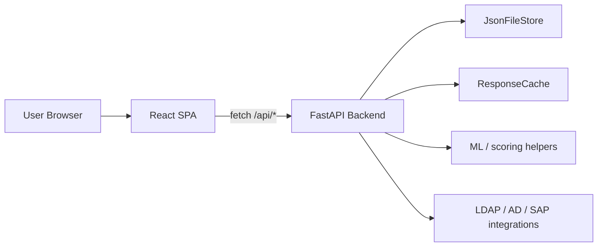

# Role Mining Architecture Overview

This document is a working map of the current codebase. It is meant to help future changes stay consistent with the existing shape of the system.

## System Shape

- The product is a two-tier web app:
  - `backend/` exposes a FastAPI API and owns business logic, persistence, auth, and analytics computations.
  - `frontend/` is a React + Vite SPA that talks to the backend through `/api/*`.
- The backend is effectively a modular monolith:
  - `backend/main.py` is a compatibility entrypoint.
  - `backend/app/server.py` wires most routes and core services.
  - `backend/app/api/*.py` adds focused route groups.
  - `backend/app/db/storage.py` persists application state to JSON on disk.
  - `backend/app/core/cache.py` provides a tenant-aware in-memory TTL cache.

## Backend Architecture

### Entry and composition

- `backend/main.py` re-exports `app.server` so old entrypoints like `uvicorn main:app` still work.
- `backend/app/server.py` is the main composition root:
  - registers the API routes,
  - loads service helpers,
  - exposes auth, ingestion, mining, KPI, reports, and admin endpoints,
  - keeps compatibility with the current data model.
- The API surface is split into smaller route modules when the logic is reasonably isolated:
  - `backend/app/api/ai_lab_routes.py`
  - `backend/app/api/pattern_rules_routes.py`

### Persistence

- Persistent state lives in `backend/app/db/storage.py`.
- Storage is file-based JSON with optional Fernet encryption via `STORAGE_ENCRYPTION_KEY`.
- The store is tenant-aware:
  - each domain maps to a tenant,
  - domain registry prevents silent tenant sharing,
  - reads and writes use file locks and atomic replace for safety.
- The code also keeps backup recovery paths for corrupted state.

### Caching

- `backend/app/core/cache.py` provides a global in-memory TTL cache.
- Cache keys are prefixed with the current tenant id so data does not bleed across domains.
- The helper `invalidate_hot_caches()` is used to clear user, role, KPI, mining, and AI-lab related entries after writes.

### Main backend domains

- Authentication and tenant registration:
  - `POST /api/auth/login`
  - `POST /api/auth/register-domain`
  - `GET /api/me`
- Configuration and system users:
  - connector settings,
  - system users CRUD,
  - AD field mapping.
- Ingestion:
  - AD extract,
  - SAP extract,
  - generic connector extract/provisioning,
  - CSV and XLSX imports.
- Role mining and modeling:
  - mining runs,
  - role-modeling sandbox,
  - apply-feedback flows,
  - business-role CRUD and assignment recalculation.
- KPIs, drilldowns, and quality:
  - KPI summary endpoints,
  - drilldown endpoints,
  - data-quality suggestions,
  - model presets.
- AI surfaces:
  - detection,
  - training patterns,
  - drift,
  - timeline,
  - A/B playground,
  - fairness,
  - synthetic data,
  - feedback loop.

### Backend design notes

- `backend/app/services/identity_quality.py` and `backend/app/services/data_quality_helpers.py` hold reusable validation and data-quality logic extracted from the main API file.
- The backend still has a lot of logic in `server.py`, so future refactors should prefer extracting one cohesive domain at a time instead of doing a broad rewrite.
- Endpoint contracts and JSON shapes should be treated as stable unless a migration is explicitly planned.

## Frontend Architecture

### Entry and routing

- `frontend/src/main.jsx` boots the React app, installs a save/loading fetch wrapper, and mounts `App` inside `BrowserRouter`.
- `frontend/src/app.jsx` is the main UI composition file:
  - sidebar navigation,
  - login flow,
  - route definitions,
  - lazy-loaded pages,
  - role/permission gating.

### State and data access

- `frontend/src/api.js` is the API client.
  - It wraps `fetch`.
  - It stores the JWT token in `localStorage`.
  - It exposes a method per backend endpoint instead of a generic service layer.
- The UI uses local helper modules for view models and derived metrics:
  - `businessRolesView.js`
  - `clusterHeatmapView.js`
  - `clusterUsersView.js`
  - `reportsCatalog.js`
  - `reportAuditPdf.js`
  - `featureFlags.js`

### Feature flags and conditional UI

- `frontend/src/featureFlags.js` controls the visibility of AI-related surfaces.
- Current defaults keep most AI surfaces off at the UI level, while leaving selected analytics surfaces available.
- Navigation and route exposure depend on permissions plus these feature flags.

### Frontend page grouping

- Analytics and drilldowns:
  - KPI drilldown,
  - overprivileged users,
  - model quality,
  - users analytics.
- AI lab:
  - drift,
  - timeline,
  - A/B playground,
  - fairness,
  - synthetic cases,
  - feedback.
- Operational pages:
  - logs,
  - reports,
  - role modeling sandbox,
  - training pattern rules.

## Core Request Flows

### Login flow

1. User submits credentials and tenant domain in the SPA.
2. Frontend calls `POST /api/auth/login`.
3. Backend returns a token, and the SPA stores it in `localStorage`.
4. All later requests attach `Authorization: Bearer <token>`.

### Ingestion flow

1. User imports data from CSV/XLSX or triggers an extractor.
2. Backend normalizes rows, validates identity fields, and derives roles/groups metadata.
3. Persistence updates the JSON store.
4. Hot caches are invalidated so KPIs and lists refresh.

### Mining and modeling flow

1. A mining or recalculation action runs on the backend.
2. Role assignments and summaries are recomputed.
3. The UI reads the updated state through KPI, users, and business-role endpoints.

### AI lab flow

1. The SPA calls the AI-lab endpoints from the route-specific pages.
2. Backend computes drift, timeline snapshots, A/B comparisons, fairness summaries, or synthetic examples.
3. Pattern-rule mutations trigger recalculation and learning-event logging.

## What To Watch

- `backend/app/server.py` is still the highest-risk file for accidental regressions because it concentrates many concerns.
- Cache invalidation is important after any write that affects users, roles, KPIs, or mining results.
- The file store is durable but simple; changes to the JSON schema should be made carefully and with migration in mind.
- Frontend route visibility is driven by both permissions and feature flags, so UI changes often need a corresponding access review.

## Practical Guidance For Future Changes

- Prefer extracting one backend domain at a time into a dedicated module.
- Keep API payloads stable and add new fields rather than renaming old ones when possible.
- Update cache invalidation whenever a new write path can affect derived data.
- Keep frontend pages lazy-loaded if they are heavy or rarely used.
- When adding a new route, update:
  - the backend route registry,
  - the API client,
  - the navigation or feature gating,
  - and, ideally, a focused test.

